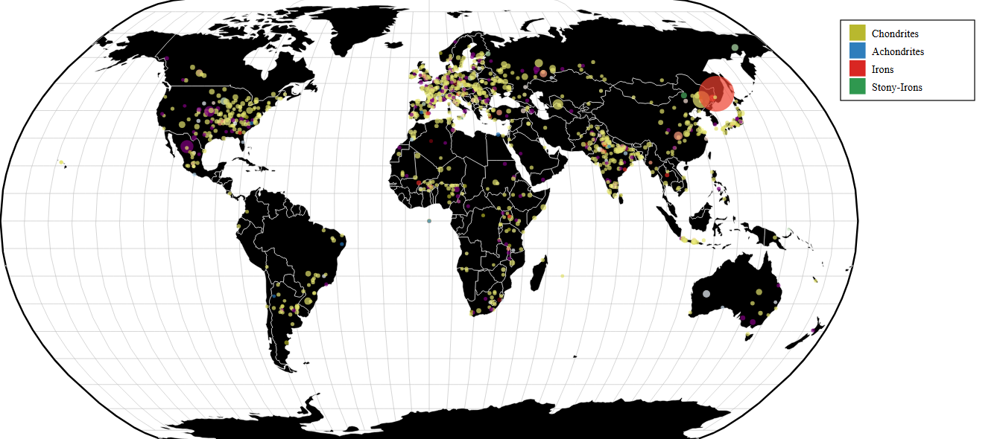
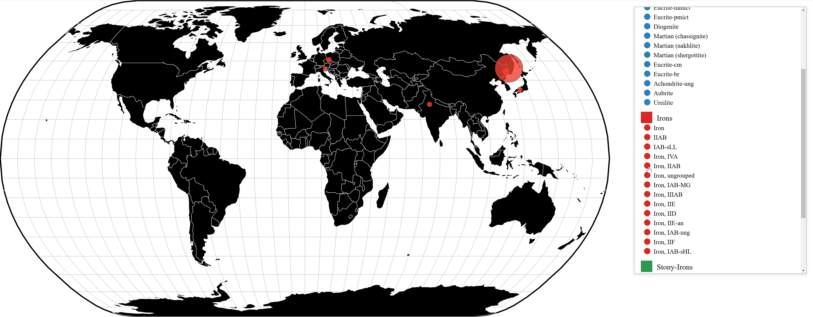
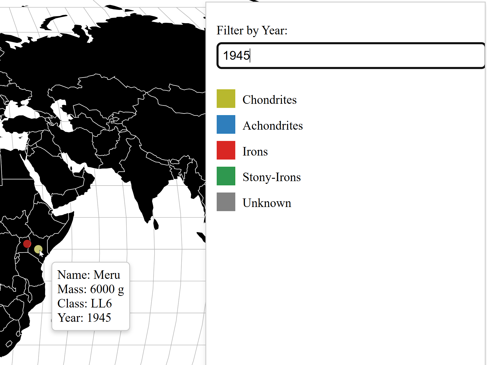
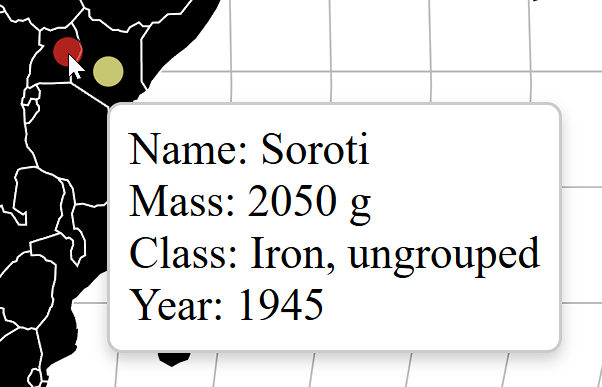
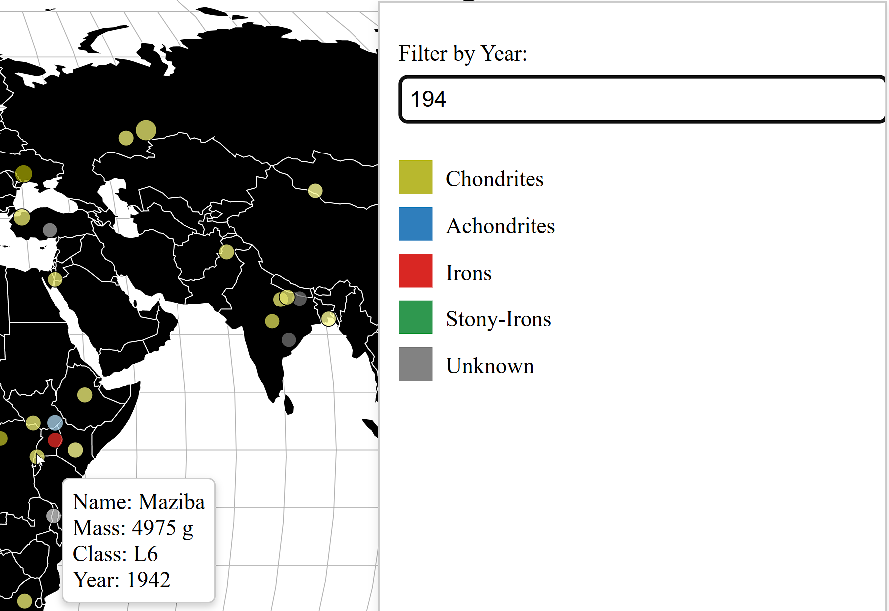

# Data Visualization Project

## Data

The data I propose to visualize for my project is a history of [Meteorite Landings](https://data.nasa.gov/Space-Science/Meteorite-Landings/gh4g-9sfh/about_data).

The dataset records historical meteorite landings since the year 1880 and the geolocations of their landings, supplied by NASA. 

## Questions & Tasks

1. **GeoLocation Accurate Landings of Each Meteorite**

   - Visualize the latitude and longitude accurate locations of the landings
    of each meteorite. Displaying with opacity the the areas with higher and
    lower effect.

2. **Compare the sizes of the meteorites.**

   - Using varying size that are relative to the mass (g) of each meteorite
     to compare the sizes of each impact.

3. **Chronological Order of Landings.**

   - Display a year counter that works in unison with the animation.
     Throughout the visualization the landings will be displayed
     one by one in consecutive order. Fading out after a period of time
     to reduce clutter.

4. **Display the Class Types of Meteorites.**

   - Visualize through hue the varying classifications of meteorites.
     This will display the common and less common classes.

5. **Compare Meteorite Size and Class Type.**

   - Using both the hue to visualize class types and size to display
     the mass of each meteorite relatively, it will visualize the
     correlation between class and size. 

## Sketches

Above is my sketch that displays how the general look will be. Notice the world map decorated in the background
to visualize rough location of landing. The world map will fill with circles to display the meteorites.

This is a more detailed depiction of the previous sketch. Notice the bars that display latitude and longitude.
The map will be to real scale coordinates. 
The circles are of different sizes and color to display the mass and class type.

This shows the interactability within the visualization. When clicking on a meteor, it will display the 
data correlated to it. Showing the categories "Name, Class, Mass (g), Year, GeoLocation" that are 
supplied by the dataset.

This image shows a comparison factor. When double clicking on another meteorite the two will be side 
by side for easy comparison. In the future I may implement a 'difference' factor that shows how much
more or less tha mass, year and GeoLocation is to the other.

## Prototypes

I’ve created a proof of concept visualization of this data. It's a scatterplot and it shows the latitude
and longitude accurate map of the world with historical data of meteorite landings. Each dot represents 
a landing, but currently does not show when they landed, what class they are and their mass.

Click on the image to be sent to the VizHub.

## Progression

### UPDATE V.2

Here is the link to version 2 of the [Vizhub Project](https://vizhub.com/reddishmatthew/projectv2).

### Data Points Size By Relative Mass (g)

### Data Points Color Based On Class

This was interesting to work with because there are many, many classes used for these meteorites. 
Therefore I was not sure how I would handle the colors. I took them into their broader categories:
Chondrites, Achondrites, Irons, Stony-Irons. 

To still include the subcategories, however, I used interpolate to create a range for the broader 
categories from lighter to darker. These different shades portray the subcategories. 

Purple is used for the subcategories not included in the broad categories. 

### Create A Color Legend

Changed the Chondrites from interpolateYlGn to interpolate ('rgb(255, 255, 153)','rgb(153, 153, 0)',). 
I noticed that interpolateYlGn was causing both Chondrites and Stony-Irons to be shades of green and 
made both the colors green on the legend. Changing to interpolate allowed me to directly control the 
gradient and make Chondrites yellow and Stony-Irons stay green. 

It is interesting to see the numerous amounts of Chondrites. 

### UPDATE V.3

Here is the link to version 3 of the [Vizhub Project](https://vizhub.com/reddishmatthew/meteorlandingsv3).

### Updating An Interactive Legend 

I have added interactability with the legend by allowing the user to click the general group and a pulldown
will show the subcategories. What I plan for this is to allow filtering for the user. When a major group is
clicked it will only show data points for that group and then when a subcategory is clicked it will only
show data points for that subcategory.

### Error And Roadblock

I have hit a roadblock where I cannot get the data points to successfully filter. When the category is clicked
there is no change. When the user uses the interactable legend and clicks a group it makes the other groups 
disappear to focus on the subcategories. To return the other categories the user just needs to click on the 
main group again. However, this has the side effect of making all data points disappear from the map. 

My goal for the upcoming week is to get these errors fixed and begin trying to animate the data points. 

### UPDATE V.4

Here is the link to version 4 of the [Vizhub Project](https://vizhub.com/reddishmatthew/meteoritedatav4).

### Tooltip Interactive With Markers 

When a user hovers over the markers it will allow them to recieve a tooltip that gives the name, mass, class, and year
of the meteorite. This is something I had in my drawings that I wanted to get done eventually, so it is exciting to see 
it live in this update.
The legend still proves to be a problem and will still be worked on.

### UPDATE V.5

Here is the link to version 5 of the [Vizhub Project](https://vizhub.com/reddishmatthew/meteorlandingsv5).

### Interactive Legend Update

A problem I have had is to have the legend successfully filter. In this iteration I have expanded the legend to include 
all subclasses that are apart of the original data.csv. This caused the legend to be rather large, so I implemeneted a scroll
to allow for more efficient use. 

And we have filtering! (Partly). When the main category is clicked it filters to that category and expands the list to show the
subcategories of that category. When clicked again it unfilters the map and collapses the list!

### Error And Roadblock

Unfortunately there are still two errors. 
1. The Unknown category does not filter on the maps.
2. The Subcategories are meant to filter to just the subcategories, however it currently reads the click as a click on the main
   category and then collapses the list instead of filtering.

These will be polished in the next iteration.

Both images above and below represent these new changes, showing filtering in two different categories.

### UPDATE V.6

Here is the link to version 6 of the [Vizhub Project](https://vizhub.com/reddishmatthew/meteorlandingsv6).

### Subcategory Legend Interactibility

In this update the subcategories are now interactive and able to filter the separate classes of the main categories.
This was something that I wished to accomplish most in the last weeks and finally got to iron it out. There are still
small edits that need to be made as some outliers seem to be filtering between two different main categories.

Here is an example of a subcategory being clicked to filter out the specific class. 

### UPDATE FOR FINAL

Here is the link to the final version of the [Vizhub Project](https://vizhub.com/reddishmatthew/meteorprojectfinal).

### Filter By Year 

As a final update I polished the Subcategory Legend by cleaning up the outliers that would be found in multiple categories
based on the filtering logic. I made this logic stricter so that the subcategory had to match by specific name. 

The main addition in this final polish is I added a year filter! Users can type a year or part of a year to filter to data points
from that time period. I find this a great addition to interactibility and an added way to learn about the meteorites. 

Here is an example where I input 1945 as the year. You can see two data points from different categories that are filtered.
As you can see in the tooltip, the year of the meteorite is 1945. 
Below shows the other meteorite with the same year.

This last image below represents the partial search ability. I only input '194' for the year search filter and now there are 
more points to be seen. You can see the same two points from 1945 represented, but the one I hover over is from 1942. 

## Future Work

ANIMATION:
I have not been able to begin on the animation aspect of my project. Creating and filtering the interactive legend and tooltips
have proven to be problematic and time consuming. What I wish to incorporate in the future is an animation based of the filtering 
clicks where the points appear in chronological order.

COMPARISON FEATURE:
I believe that the tooltips could have a comparison feature. Currently the tooltips appear when the mouse hovers over the data point.
If the mouse is clicked it could keep the tooltip from disappearing when the mouse moves away and then allow the user to hover over
another data point and show a second tooltip. Then with both tooltips showing, the user can see between two meteorite's information.

GLOBE VISUAL:
I could make the world map a globe. Then add slider bars to rotate the globe and the data points not on the visible face will be filtered out.
Lastly, add more data from the original .csv file from NASA.

## Milestones

  -  **Week 8:** Create the world map and change the sizes of the data points by mass.
  -  **Week 9:** Change the hue based on the class type. Add a year counter.
  -  **Week 10:** Animate the data points to enter one at a time, year counter follows.
  -  **Week 11:** Add a second animation so the data points fade once a maximum amount of data points shown is reached.
  -  **Week 12:** Create a mouse click interaction to display data.
  -  **Week 13:** Create a comparison tool that expands on the mouse click interaction.
  -  **Week 14:** Finalize and report.
